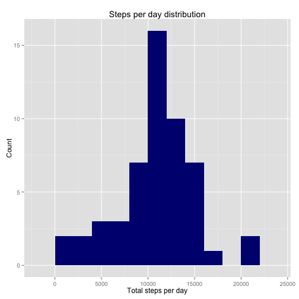
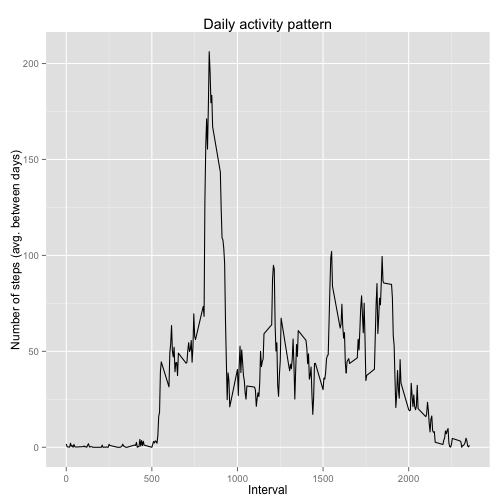
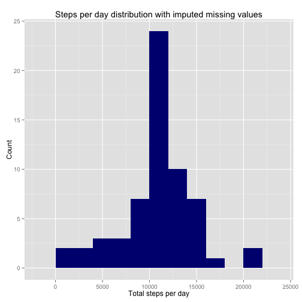
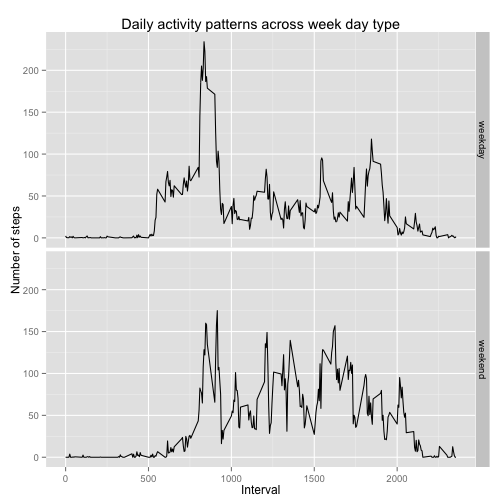

## Loading and preprocessing the data

First of all, I read the data from the source CSV file:


```r
data <- read.csv(unz("activity.zip", "activity.csv"), sep=",",
                 stringsAsFactors = FALSE)

head(data, 4)
```

```
##   steps       date interval
## 1    NA 2012-10-01        0
## 2    NA 2012-10-01        5
## 3    NA 2012-10-01       10
## 4    NA 2012-10-01       15
```

```r
data[1000:1003,]
```

```
##      steps       date interval
## 1000     0 2012-10-04     1115
## 1001     0 2012-10-04     1120
## 1002   180 2012-10-04     1125
## 1003    21 2012-10-04     1130
```

## What is mean total number of steps taken per day?

In order to answer the question, we first summarize total number of steps by 
date:


```r
totalByDay <- data %>% 
    select(date, steps) %>%
    group_by(date) %>%
    summarise(total = sum(steps))
head(totalByDay)
```

```
## Source: local data frame [6 x 2]
## 
##         date total
## 1 2012-10-01    NA
## 2 2012-10-02   126
## 3 2012-10-03 11352
## 4 2012-10-04 12116
## 5 2012-10-05 13294
## 6 2012-10-06 15420
```

Histogram of the total number of steps per day:


```r
ggplot(totalByDay, aes(x=total)) + 
    geom_histogram(binwidth = 2000, fill = "navy") +
    ggtitle("Steps per day distribution") + 
    labs(x = "Total steps per day", y = "Count")
```

 

Mean of the total number of steps taken each day:


```r
mean(totalByDay$total, na.rm = TRUE)
```

```
## [1] 10766.19
```

Median of the total number of steps taken each day:


```r
median(totalByDay$total, na.rm = TRUE)
```

```
## [1] 10765
```

## What is the average daily activity pattern?

In order to answer the question, we summarize average number of steps between
days per interval:


```r
avgByInterval <- data %>% 
    group_by(interval) %>% 
    summarize(avgSteps = mean(steps, na.rm = TRUE)) 
```

Daily activity pattern - a time series plot of the average number of steps taken
per the 5-minute interval:


```r
qplot(avgByInterval$interval, avgByInterval$avgSteps, geom="line",
      main = "Daily activity pattern",
      xlab = "Interval", ylab = "Number of steps (avg. between days)")
```

 

The 5-minute interval which, on average across all days in the dataset, contains
maximum number of steps:


```r
avgByInterval[which.max(avgByInterval$avgSteps),]$interval
```

```
## [1] 835
```

## Imputing missing values

The source dataset contains some missing values. Total number of missing values:


```r
sum(!complete.cases(data))
```

```
## [1] 2304
```

I chose a strategy to impute missing values by substituting a rounded average 
(mean) number of steps for the particular 5-minute interval across all days in
the dataset:


```r
dataWithAveragesPerInterval <- merge(data, avgByInterval, by = "interval")

dataWithImputedNAs <- dataWithAveragesPerInterval %>% 
    mutate(stepsWithImputedNAs = ifelse(is.na(steps), round(avgSteps), steps)) %>%
    select(date, interval, stepsWithImputedNAs) %>%
    arrange(date, interval)

head(dataWithImputedNAs)
```

```
##         date interval stepsWithImputedNAs
## 1 2012-10-01        0                   2
## 2 2012-10-01        5                   0
## 3 2012-10-01       10                   0
## 4 2012-10-01       15                   0
## 5 2012-10-01       20                   0
## 6 2012-10-01       25                   2
```

Histogram of the total number of steps (with imputed missing values) per day:


```r
totalByDayWithImputedNAs <- dataWithImputedNAs %>% 
    select(date, stepsWithImputedNAs) %>%
    group_by(date) %>%
    summarise(total = sum(stepsWithImputedNAs))

ggplot(totalByDayWithImputedNAs, aes(x=total)) + 
    geom_histogram(binwidth = 2000, fill = "navy") +
    ggtitle("Steps per day distribution with imputed missing values") + 
    labs(x = "Total steps per day", y = "Count")
```

 

Mean of the total number of steps (with imputed missing values) taken each day:


```r
mean(totalByDayWithImputedNAs$total, na.rm = TRUE)
```

```
## [1] 10765.64
```

Median of the total number of steps (with imputed missing values) taken each
day:


```r
median(totalByDayWithImputedNAs$total, na.rm = TRUE)
```

```
## [1] 10762
```

We can see that imputing the missing values with the chosen strategy does not
significantly impact on estimates of total number of steps per day for the
dataset in question.

The histogram of the total number of steps per day stayed the same. There is a
minor decrease at both mean and median values, but at the order of magnitude of
less than 0.03% the difference can be ignored.

## Are there differences in activity patterns between weekdays and weekends?

To answer the qestion, I first introduced a factor to partition the data into
weekdays and weekends:


```r
weekendDayNames = c("Saturday", "Sunday")

dataWithWeekendFactor <- data %>%
    mutate(weekDayName = weekdays(as.Date(date))) %>%
    mutate(isWeekend = is.element(weekDayName, weekendDayNames)) %>%
    mutate(weekDayType = as.factor(ifelse(isWeekend, "weekend", "weekday"))) %>%
    select(-weekDayName, -isWeekend)

summary(dataWithWeekendFactor)
```

```
##      steps            date              interval       weekDayType   
##  Min.   :  0.00   Length:17568       Min.   :   0.0   weekday:12960  
##  1st Qu.:  0.00   Class :character   1st Qu.: 588.8   weekend: 4608  
##  Median :  0.00   Mode  :character   Median :1177.5                  
##  Mean   : 37.38                      Mean   :1177.5                  
##  3rd Qu.: 12.00                      3rd Qu.:1766.2                  
##  Max.   :806.00                      Max.   :2355.0                  
##  NA's   :2304
```

```r
avgByIntervalWithWeekendFactor <- dataWithWeekendFactor %>% 
    group_by(interval, weekDayType) %>% 
    summarize(avgSteps = mean(steps, na.rm = TRUE)) 

summary(avgByIntervalWithWeekendFactor)
```

```
##     interval       weekDayType     avgSteps      
##  Min.   :   0.0   weekday:288   Min.   :  0.000  
##  1st Qu.: 588.8   weekend:288   1st Qu.:  1.854  
##  Median :1177.5                 Median : 26.295  
##  Mean   :1177.5                 Mean   : 39.208  
##  3rd Qu.:1766.2                 3rd Qu.: 62.321  
##  Max.   :2355.0                 Max.   :234.103
```

A panel plot to compare average number of steps per 5-minute interval pattern
between weekday and weekend days:


```r
qplot(interval, avgSteps, data = avgByIntervalWithWeekendFactor, 
      geom = c("line"), facets = weekDayType ~ .,
      main = "Daily activity patterns across week day type",
      xlab = "Interval", ylab = "Number of steps")
```

 

The plot suggests that there might be a few differences between weekday and
weekend days activity patterns for the dataset in question:

* weekend days activity starts later than weekday one

* overall activity during daytime period (10am - 20pm approximately) on weekends
    is noticeably larger than on weekday days
    
* at the same time, overall morning activity (before 10am approximately) is
    noticeably larger on weekday days
